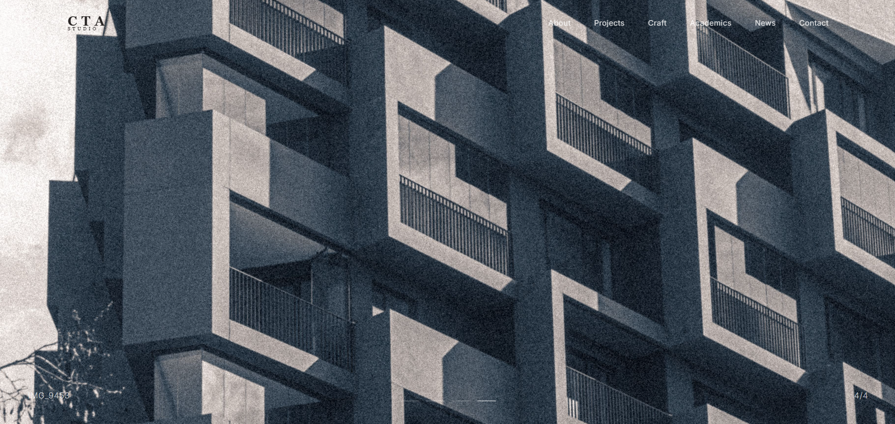

# CTA Architects

A modern architectural design studio website built with React and TailwindCSS 



## Features

- **Full-screen image slider** on the home page with auto-rotating fade transitions
- **Responsive navigation** — transparent on home, solid white on inner pages
- **Projects gallery** — 2-column grid with category filters (Architecture, Conservation, Landscape, Social, Exhibition)
- **Individual project detail pages** with full-width stacked images
- **Pages**: Home, About, Projects, Craft, Academics, News, Contact

## Tech Stack

- [React](https://react.dev/) + [Vite](https://vite.dev/)
- [TailwindCSS v4](https://tailwindcss.com/)
- [React Router](https://reactrouter.com/)

## Getting Started

```bash
# Install dependencies
npm install

# Start dev server
npm run dev

# Build for production
npm run build
```

## Project Structure

```
src/
├── components/
│   └── Navbar.jsx
├── pages/
│   ├── Home.jsx
│   ├── About.jsx
│   ├── Projects.jsx
│   ├── ProjectDetail.jsx
│   ├── Craft.jsx
│   ├── Academics.jsx
│   ├── News.jsx
│   └── Contact.jsx
├── App.jsx
├── main.jsx
└── index.css
```

## License

This project is for educational purposes.
